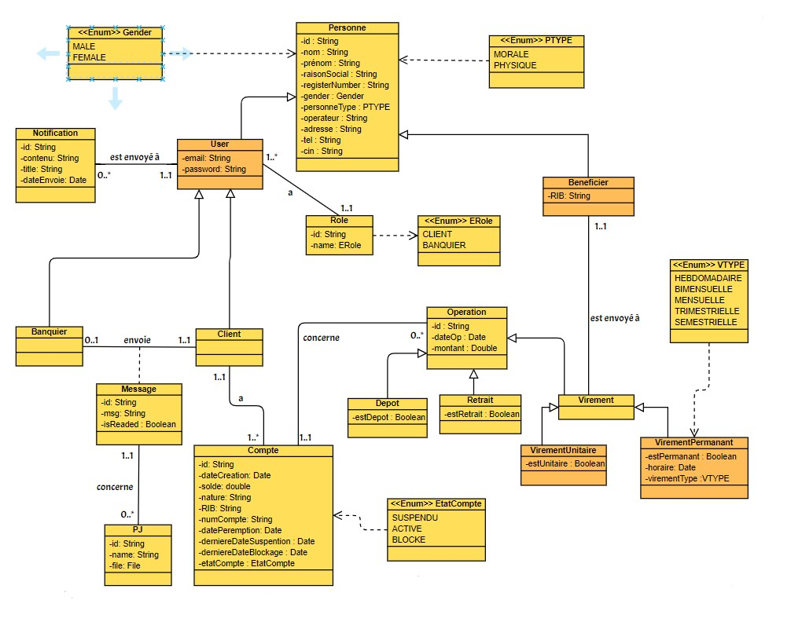

# E-bancking Backend

This is the backend application for an E-banking system.

## Architecture Diagram

*Backend Architecture Diagram*

## Class Diagram v1

*Class Diagram*

## Class Diagram v2

*Class Diagram*

## Class Diagram v3

*Class Diagram*

## Dependencies

The project uses the following dependencies:

- [Spring Boot Data JPA](https://spring.io/projects/spring-data-jpa)
- [Spring Boot Security](https://spring.io/projects/spring-security)
- [Spring Boot Web](https://spring.io/projects/spring-boot)
- [MySQL Connector/J](https://dev.mysql.com/downloads/connector/j/)
- [Lombok](https://projectlombok.org/)
- [JJWT (JSON Web Token)](https://github.com/jwtk/jjwt)
- [Springdoc OpenAPI](https://springdoc.org/)
- [Spring Boot Validation](https://spring.io/guides/gs/validating-form-input/)
- [Spring Boot Starter Test](https://docs.spring.io/spring-boot/docs/current/reference/html/spring-boot-features.html#boot-features-testing)
- [Spring Security Test](https://docs.spring.io/spring-security/site/docs/current/reference/html5/#test)
- [Spring Boot Starter Mail](https://docs.spring.io/spring-boot/docs/current/reference/html/boot-features-email.html)
- [JUnit](https://junit.org/junit4/)
- [AssertJ](https://assertj.github.io/doc/)
- [Mockito](https://site.mockito.org/)

## Build Instructions

To build the project, make sure you have [Maven](https://maven.apache.org/) installed on your system. Then, run the following command:

This will compile the project, run the tests, and package the application into a JAR file.

## Usage

Provide any necessary information about using the application here.

add class image backend archtecture diagram that it exists on ./assets/Backend.jpg
add class image class  diagram that it exists on ./assets/class diagram.jpg